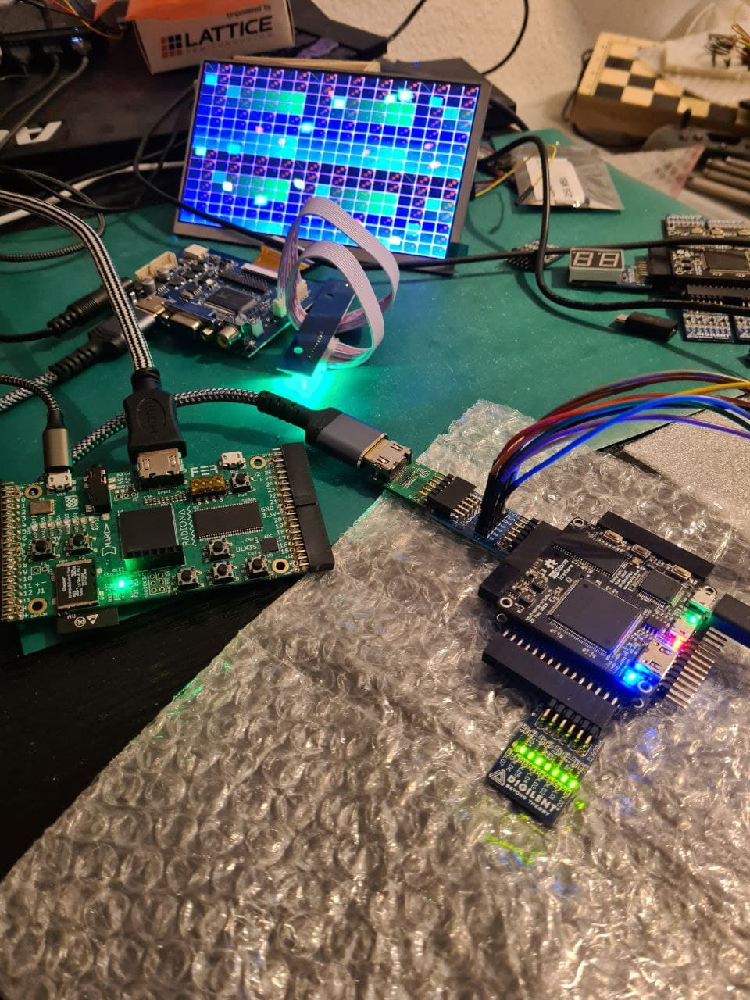

my_hdmi_device is an implementation based of reading fpga4fun, ulx3s dvi (vga2dvi) examples and larries hdmi blackicemx example.
I learned from reading the code, but I haven't understood too much.
That is why I rewritten the tmds encoder directly from dvi standard, Page 29. without any problems. And to learn about tmds encoding and why
we have lvds and what are the problems in general, why we have 8b10b and more.
The idea to shift and to have faster clock I have seen in all implementations. I learned about DDR and SDR transmission :)
Howto do it on ice40k I learnd from mystrom and larries example hdmi code.
The technic of vga, balls and stars I have learned from Steven Hugg (Designing Video Game Hardware in Verilog).
I used the parts for calculating the vga timings from ulx example code, because normally you see the stupid values fixed in tables.
I have written all from scratch over the christmas days and I used the hdmi pmod from Luke Wreen as a gift from ultraembedded.
I want to share what I figured out and works. Maybe the code could be a new base for other projects. Just use tmds_encoder, hdmi_device.h
and learn from top module and you are prepared for the next project.

This code runs on blackicemx and ulx3s-85F (but you are able to adjust the Makefile and generating lesser balls).
I don't want to go deep in thing, because I want to learn many fpga designs in the future. But you have to start with the basics first.

I have used this pmod for ice40 based fpgas: https://github.com/Wren6991/DVI-PMOD

Todo: hdmi-audio (island)

ulx3s:
make prog

blackicemx:

make -f Makefile.blackicemx prog

icoboard:

make -f Makefile.icoboard prog

icestick:
cd icestick__hack
make prog

Have fun!

Hirosh

